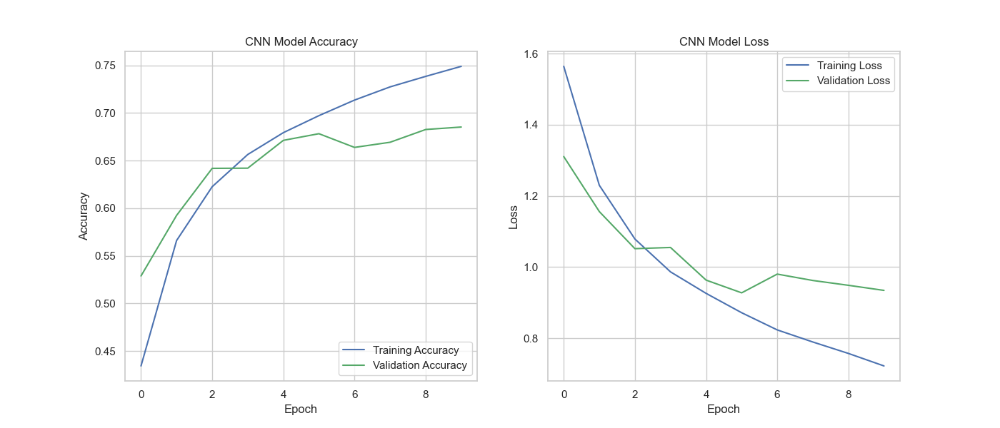
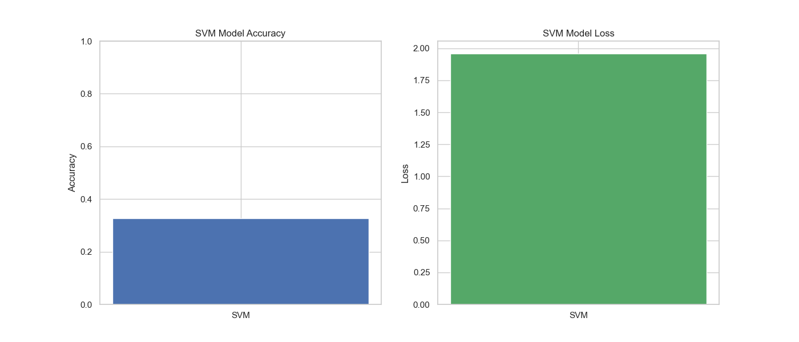

# CNN vs SVM — Image Recognition on CIFAR-10

A comparative study of **Convolutional Neural Networks (CNN)** and **Support Vector Machines (SVM)** for image classification on the [CIFAR-10](https://www.cs.toronto.edu/~krivzhevsky/cifar.html) dataset.

The project benchmarks both models across four dimensions: **accuracy, loss, training time, and memory usage** — highlighting the trade-offs between deep learning and classical ML approaches for computer vision tasks.

---

## Results

| Metric | CNN | SVM |
|---|--:|--:|
| **Accuracy** | 68.11% | 32.61% |
| **Loss** | — | 1.9589 |
| **Training Time** | 76.17 s | 849.86 s |
| **Memory Usage** | 112.35 MB | 3.98 MB |

### CNN Training Curves

<p align="center">
  
</p>

### SVM Performance

<p align="center">
  
</p>

### Side-by-Side Comparison

<p align="center">
  
</p>

---

## Key Takeaways

- **CNN dominates accuracy** — roughly 2× the SVM score — because convolutional layers learn spatial features that a linear SVM on flattened pixels cannot capture.
- **SVM is far more memory-efficient** (≈4 MB vs ≈112 MB) but takes >10× longer to train, even on a reduced 3,000-sample subset.
- The CNN still shows room for improvement (validation accuracy plateauing around 68%) — deeper architectures, data augmentation, or learning-rate scheduling could push this higher.

---

## Project Structure

```
cnn-vs-svm-cifar10/
├── src/
│   ├── train.py            # Main training script (CNN + SVM)
│   └── plot_results.py     # Generate plots from saved results
├── results/
│   ├── results.npy         # Raw metrics (numpy dict)
│   ├── results.txt         # Human-readable summary
│   └── cnn_history.npy     # CNN epoch-by-epoch history (generated by train.py)
├── assets/
│   ├── cnn_accuracy_plot.png
│   ├── cnn_loss_plot.png
│   ├── svm_performance_plot.png
│   └── comparison_plot.png
├── requirements.txt
├── LICENSE
└── README.md
```

---

## Quick Start

### 1. Clone & install

```bash
git clone https://github.com/<your-username>/cnn-vs-svm-cifar10.git
cd cnn-vs-svm-cifar10
pip install -r requirements.txt
```

### 2. Run training

```bash
python src/train.py
```

CIFAR-10 downloads automatically on first run. Configurable flags:

```bash
python src/train.py --epochs 20 --batch-size 128 --svm-samples 5000 --pca-variance 0.95
```

| Flag | Default | Description |
|---|---|---|
| `--epochs` | 10 | CNN training epochs |
| `--batch-size` | 64 | CNN batch size |
| `--svm-samples` | 3000 | Training samples for SVM |
| `--pca-variance` | 0.90 | PCA explained variance ratio |

### 3. Generate plots

```bash
python src/plot_results.py
```

---

## Tech Stack

- **TensorFlow / Keras** — CNN model
- **scikit-learn** — SVM, PCA, StandardScaler
- **matplotlib** — Visualization
- **NumPy** — Data handling
- **psutil** — Memory profiling

---

## Future Improvements

- [ ] Add RBF kernel SVM comparison
- [ ] Implement data augmentation for CNN
- [ ] Test deeper architectures (ResNet, VGG)
- [ ] Train SVM on full dataset with SGDClassifier
- [ ] Add confusion matrices and per-class metrics

---

## License

[MIT](LICENSE)
